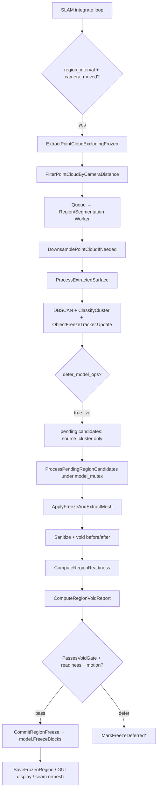

# Region Mesh Pipeline 흐름 분석 (ObjectMeshPipeline.h 중심)

**날짜**: 2026-07-16
**범위**: 후보 추출 → RegionVoidReport / PassesVoidGate / readiness → freeze
**수정 없음**, 최소 변경 설계만 기록

---

## 1. 전체 파이프라인 (데이터 흐름)



### 핵심 파일

| 단계 | 파일 | 함수 | 대략 라인 |
|------|------|------|-----------|
| 설정 | `SLAM/cpp/ObjectMeshPipeline.h` | `BuildLiveRegionSegmentationConfig` | 2154–2192 |
| 표면 입력 | `RealTimeSLAMRealSense.cpp` / `OnlineSLAMUtil.h` | region extract + queue | 1591–1713 / 1697–1745 |
| 클러스터·추적 | `ObjectMeshPipeline.h` | `ProcessExtractedSurface` | 1934–2071 |
| 안정성 | `ObjectMeshPipeline.h` | `ObjectFreezeTracker::Update` | 729–817 |
| 메시·블록 | `ObjectMeshPipeline.h` | `ApplyFreezeAndExtractMesh` | 1239–1382 |
| readiness | `ObjectMeshPipeline.h` | `ComputeRegionReadiness` | 1384–1438 |
| void | `ObjectMeshPipeline.h` | `ComputeRegionVoidReport` | 1462–1521 |
| 게이트 | `ObjectMeshPipeline.h` | `PassesVoidGate` | 423–434 |
| 커밋 | `ObjectMeshPipeline.h` | `CommitRegionFreeze` | 1534–1551 |
| 오케스트레이션 | `ObjectMeshPipeline.h` | `ProcessPendingRegionCandidates` | 1639–1797 |
| TSDF freeze | `cpp/open3d/t/pipelines/slam/Model.cpp` | `FreezeBlocks` | 181–187 |

---

## 2. 후보 추출 상세 (`ProcessExtractedSurface`)

**입력**: `ExtractPointCloudExcludingFrozen`으로 얻은 tensor point cloud (frozen 블록 제외 표면)

1. **전처리** (caller): `DownsamplePointCloudIfNeeded` — 최대 60k/50k points, voxel downsample (DBSCAN 안정성)
2. **DBSCAN** (`1948–1950`): `ClusterDBSCAN(eps, min_points)`
3. **클러스터 필터** (`1972–1992`):
   - `min_cluster_points` 미만 제거
   - `max_cluster_extent_m` 초과 시 `SplitClusterByExtentGrid` 타일 분할
4. **분류** (`1966`): `ClassifyCluster` → wall/box/cylinder/generic (`1102–1166`, legacy OBB/plane)
5. **시그니처** (`1967`): `BuildClusterSignature` (centroid, obb_extent, type)
6. **추적·freeze 트리거** (`2028–2029`): `ObjectFreezeTracker::Update`
   - `stable_frames >= stability_frames` → `pending_freeze`, `assigned_id`, `build_candidate` 호출
   - `require_camera_motion` + `camera_moved_since_last_check` 가 stable_frames 증가 조건

**Live config** (`BuildLiveRegionSegmentationConfig` 2163–2165):
- `tsdf_mesh_only = true`
- `defer_model_ops = true` → **메시 추출은 worker 2단계에서만** (`ProcessPendingRegionCandidates`)

---

## 3. Mesh 추출·게이트·Freeze (`ProcessPendingRegionCandidates`)

**정렬**: occupancy 높은 후보 우선 (`1652–1660`), readiness 점수로 커밋 순서 (`1705–1708`)

### 3.1 사전 게이트 (extract 전)

- 정지 카메라 (`1677–1681`): `require_camera_motion && !camera_moved_since_last_check` → `MarkFreezeDeferredStationary`, CUDA illegal-access 반복 방지

### 3.2 `ApplyFreezeAndExtractMesh` (1239–1382)

1. `TightenClusterForFreeze` — legacy statistical outlier (`464–478`)
2. `CollectBlockKeys` → `ExpandBlockKeysByBlockRadius(seam)` → frozen 이웃 merge (`1264–1274`)
3. `model.ExtractTriangleMeshIncluding(weight_threshold, -1, block_keys)` (`1306–1307`)
4. **Legacy 변환 루프** (`1318–1344`):
   - `candidate.mesh.ToLegacy()` → `SanitizeRegionTriangleMesh` → `TriangleMesh::FromLegacy`
   - sanitize 전후 `ComputeLocalVoidFromPoints` → `void_ratio_before/after_sanitize`
5. `freeze_attempt > 0` 시 `weight_threshold` 0.5씩 완화 (`1292–1297`, `1523–1531`)

### 3.3 `ComputeRegionReadiness` (1384–1438)

| 지표 | 계산 |
|------|------|
| `occupancy` | 클러스터 포인트의 coarse grid 점유율 (`210–248`) |
| `yield_ratio` | mesh_vertex_count / TSDF surface point count |
| `boundary_ratio` | `ComputeMeshBoundaryRatio` — boundary edge / total edges (`250–280`) |
| `score` | 0.4×yield + 0.3×occupancy + boundary_weight×(1−boundary/max) |

surface point: `model.voxel_grid_.ExtractPointCloudIncluding(weight, -1, block_keys)`

### 3.4 `ComputeRegionVoidReport` (1462–1521)

- surface: `ExtractPointCloudIncluding` 또는 cluster fallback
- mesh vertices: `candidate.mesh.ToLegacy().vertices_`
- **boundary strip**: frozen 블록 중 candidate 이웃 → `BlockKeysWorldCenters` (`1499–1507`)
- `ComputeLocalVoidFromPoints` (`355–421`): surface cell − mesh cell = void, boundary_void는 strip 반경 `block_extent * 1.5` 내

### 3.5 커밋 게이트 (1710–1759)

```
valid_mesh?
  → flush = ShouldFlushHoley(session_stopping)
  → min_readiness = EffectiveMinReadiness(hole_defer, flush)
  → PassesVoidGate(void_report, flush)?
  → readiness >= min_readiness OR flush?
  → CommitRegionFreeze → MarkFreezeCommitted
  → RemeshCommittedRegion (이웃 seam)
```

**`PassesVoidGate`** (423–434):
- normal: void_ratio, max_void_blob, boundary_void_ratio
- flush: void_ratio ×1.5, max_void_blob ×1.5 (boundary_void 미검사)

---

## 4. Boundary loop 계산 — 적절한 위치

### 현재 상태

- **명시적 boundary loop 추출 없음**
- `ComputeMeshBoundaryRatio`: mesh edge histogram에서 count==1 인 edge 비율만 사용 (loop topology 아님)
- `boundary_void_ratio`: TSDF frozen 이웃 **블록 중심** strip 기준 grid void (mesh boundary loop 아님)
- legacy `TriangleMesh::GetNonManifoldEdges(allow_boundary_edges=false)` 는 존재하나 pipeline 미사용

### 권장 삽입 위치 (최소 변경)

| 우선순위 | 위치 | 이유 |
|----------|------|------|
| **1 (권장)** | `ApplyFreezeAndExtractMesh` 내 sanitize **직후** (~1332–1344) | legacy mesh 확정 직후, void before/after와 동일 스코프, `candidate`에 loop 메타 저장 가능 |
| 2 | `ComputeRegionReadiness` (~1416–1419) | readiness의 `boundary_ratio`를 loop 기반 지표로 대체/보강 |
| 3 | `ComputeRegionVoidReport` (~1494–1513) | boundary strip을 mesh loop 근처로 정렬 시 void 게이트 정밀화 |

### 최소 변경 설계

```cpp
// ObjectMeshPipeline.h — 신규 helper (legacy mesh 입력)
struct RegionBoundaryLoopReport {
    int loop_count = 0;
    int open_boundary_edges = 0;
    double max_loop_perimeter = 0.0;
    std::vector<std::vector<int>> loops;  // optional, 비용 큼
};

// 삽입: SanitizeRegionTriangleMesh 직후, void_after 계산 전/후
RegionBoundaryLoopReport loops = ExtractBoundaryLoops(legacy);  // edge adjacency BFS/DFS
candidate.boundary_loops = loops;  // FrozenObjectCandidate 필드 1개 추가

// readiness: boundary_ratio 대체 또는 가중 혼합
// void: boundary_strip_centers를 loop centroid/edge midpoint로 공급
```

Open3D legacy에 loop 전용 API 없음 → `edge_count==1` edge를 seed로 boundary component tracing (표준 mesh topology).

---

## 5. Legacy / Tensor mesh 변환 상태

| 객체 | 저장 형식 | 변환 지점 |
|------|-----------|-----------|
| `source_cluster` | `t::geometry::PointCloud` (CPU) | classify/signature 시 `ToLegacy()` |
| `candidate.mesh` | `t::geometry::TriangleMesh` | extract 후 CPU (`1317`), sanitize는 legacy 왕복 |
| `committed_region_meshes` | tensor mesh | display/save 시 `ToLegacy()` |
| `block_keys` | `core::Tensor` (N,3) Int32 CPU | 항상 CPU, empty는 `(0,3)` |
| GUI (RealTime) | `geometry::TriangleMesh` shared_ptr | `seam.mesh.ToLegacy()` |
| GUI (OnlineSLAM) | `FrozenObjectEntry.mesh` tensor → scene 시 legacy | `AddFrozenMeshesToScene` 875 |

**패턴**: compute-heavy sanitize/void/readiness boundary는 **legacy**; SLAM model I/O는 **tensor**; 최종 저장·렌더는 **legacy**.

`defer_model_ops=true` 경로에서는 `ProcessExtractedSurface`가 mesh를 만들지 않고 `source_cluster`만 채움 (2015–2020).

---

## 6. TSDF voxel weight — block_keys 범위 읽기

### 공개 API 현황

**block_keys 범위 weight 직접 조회 API 없음.** extract 계열이 내부적으로 `weight_threshold` 필터만 적용.

### 기존 접근 패턴

#### A. Extract API (간접, 이미 사용 중)

```cpp
model.voxel_grid_.ExtractPointCloudIncluding(weight_threshold, -1, block_keys);
model.ExtractTriangleMeshIncluding(weight_threshold, -1, block_keys);
```

- 구현: `VoxelBlockGrid.cpp` 617–653, 737–781
- 내부: `FilterActiveBufIndices` → `ConstructTensorMap` → kernel이 weight >= threshold voxel만 surface로

#### B. HashMap + GetAttribute (직접, 후보 block_keys 범위)

`Model` 생성 시 attr: `tsdf: Float32, weight: UInt16, color: UInt16` (`Model.cpp` 91–94)

```cpp
auto& vbg = model.voxel_grid_;
core::HashMap hm = vbg.GetHashMap();
core::Tensor weight_soa = vbg.GetAttribute("weight");
// shape: [capacity, block_resolution, block_resolution, block_resolution, 1]

// 1) block_keys → buf_indices
core::Tensor buf_indices, masks;
hm.Find(block_keys.Contiguous(), buf_indices, masks);
buf_indices = buf_indices.IndexGet({masks});  // 존재하는 키만

// 2) 블록 단위 weight slice
core::Tensor block_weights = weight_soa.IndexGet({buf_indices.To(Int64)});

// 3) voxel 단위 (테스트 패턴: VoxelBlockGrid.cpp Indexing 177–194)
core::Tensor voxel_indices = vbg.GetVoxelIndices(buf_indices);
// weight_soa.IndexGet({voxel_indices[0], vx, vy, vz}) 등 advanced indexing
```

#### C. FilterActiveBufIndices (비공개 static)

- `VoxelBlockGrid.cpp` 151–192 — `Extract*Including`과 동일 필터 로직
- SLAM에서 재사용하려면: (1) 소규모 helper를 `ObjectMeshPipeline.h`에 CPU block-key set으로 복제, 또는 (2) upstream에 `VoxelBlockGrid::GetActiveBufIndicesForKeys` 공개 API 추가

#### D. GetVoxelCoordinatesAndFlattenedIndices(buf_indices)

- 특정 블록의 metric 좌표 + flattened index로 weight/tsdf 샘플링 (`VoxelBlockGrid.h` 97–101)

### 최소 변경 설계 (weight 기반 readiness/void 보강)

```cpp
// ObjectMeshPipeline.h — model_mutex 안에서 호출
RegionWeightStats ComputeBlockWeightStats(
    t::geometry::VoxelBlockGrid& vbg,
    const core::Tensor& block_keys) {
    // hm.Find + GetAttribute("weight") + buf_indices IndexGet
    // 반환: min/max/mean weight, fraction >= threshold
}
```

삽입 위치: `ComputeRegionReadiness` 또는 `ApplyFreezeAndExtractMesh` 직후 — `yield_ratio` 보정, `weight_threshold` 동적 조정에 활용.

---

## 7. RealTimeSLAMRealSense.cpp vs OnlineSLAMUtil.h 호출 차이

### 공통 (동일 파이프라인)

- `BuildLiveRegionSegmentationConfig` → `defer_model_ops=true`, `tsdf_mesh_only=true`
- `ProcessExtractedSurface` (mutex 밖) → `ProcessPendingRegionCandidates` (`model_mutex` 안)
- `CameraMovedEnough` + motion anchor/hash delta
- exit flush: `last_*_surface` 재큐잉

### 차이점

| 항목 | RealTimeSLAMRealSense.cpp | OnlineSLAMUtil.h |
|------|---------------------------|------------------|
| Worker | `RegionWorker` (591–777), `region_thread` (2360+) | `SegmentationWorker` (894–1127), 항상 기동 |
| Queue API | `region_mutex` / `region_requested` (1683–1695) | `QueueSegmentationCloud` (811–826) |
| Downsample cap | `kMaxRegionSegmentationPoints=60000` (243) | region: `kMaxSegmentationPoints`; non-region legacy path: **RandomDownSample** (881–892) |
| depth_max | `params.regions.depth_max_m` 고정 (1669–1670) | `min(region_settings_.depth_max_m, prop_values_.depth_max)` (1710–1712) |
| DBSCAN tuning | profile 기반만 | `exit_on_empty_frame_` 시 centroid_match_eps↑, extent_iou_min↓, max_extent 2.5m (791–798) |
| Region weight | `params.regions.extract_weight` | `region_settings_.extract_weight` |
| Display extract | SlamWorker 내 sync, `ExtractWeightThreshold(frame_id)` (1717) | 별도 `ExtractWorker` (1129+), GUI surface |
| Post-commit UI | `DisplayState::PushRegionPair` + `SetRegionCount` | `FrozenObjectEntry` + `PostToMainThread(AddFrozenMeshesToScene)` |
| Seam update | `state.PushRegionPair` 직접 | `seam_objects` → main thread |
| Non-region mode | regions 플래그 없으면 worker 미기동 | `region_settings_.enabled=false` 시 **구식** `BuildSegmentationConfig` + 즉시 freeze (`1075–1097`, defer 없음) |
| Tracking gate | `consecutive_tracking_failures <= kLostTrackingThreshold` (1593) | 동등 로직 update loop 내 |
| Records mutex | `records_mutex` | `region_records_mutex_` |

---

## 8. 최소 변경 설계 요약

### 목표별 변경점 (파일 1개 중심: `SLAM/cpp/ObjectMeshPipeline.h`)

1. **Boundary loop**
   - `ExtractBoundaryLoops(geometry::TriangleMesh&)` helper 추가 (~280 근처)
   - `FrozenObjectCandidate`에 `RegionBoundaryLoopReport` 필드
   - `ApplyFreezeAndExtractMesh` sanitize 직후 호출 (1곳)
   - readiness `boundary_ratio` 입력 개선 (선택)

2. **TSDF weight 조회**
   - `ComputeBlockWeightStats(vbg, block_keys)` helper 추가
   - `ComputeRegionReadiness`에서 `yield_ratio` / retry 정책 보강
   - 호출은 반드시 `model_mutex` 보유 컨텍스트 (`ProcessPendingRegionCandidates`)

3. **호출자 정합성** (선택, 2파일)
   - OnlineSLAM non-region fallback을 region defer 경로와 분리 유지 (의도된 차이)
   - depth_max band 통일: RealTime에도 `min(region_depth_max, slam_depth_max)` 적용 검토

### 변경하지 않을 것

- `ProcessExtractedSurface` / `ObjectFreezeTracker` 공개 API
- `Model::FreezeBlocks` / `VoxelBlockGrid` extract kernel
- caller worker threading 모델

### 테스트 제안

- 단위: synthetic legacy mesh → `ExtractBoundaryLoops` loop_count
- 통합: 짧은 bag + `--regions`, deferred void/holey 로그 확인
- weight helper: known integrate frame 후 block_keys subset mean weight

---

## 9. 관련 Analysis 문서

- `Analysis/object-mesh-freeze.md`
- `Analysis/구멍_영역_Mesh_지연_Defer_20260714.md`
- `Analysis/SLAM_RealTimeSLAMRealSense_RegionSystem.md`
