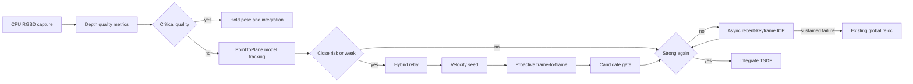

# 근접 촬영 포즈 유지 (2026-07-16)

## 목표

D415가 물체에 가까워졌을 때 depth 결손·평면 퇴화·낮은 overlap으로 발생하는 tracking lost를 줄인다.  
대상: `SLAM/cpp/RealTimeSLAMRealSense.cpp` 라이브 RealSense 경로. OnlineSLAM/IMU는 범위 외.

**고정 규칙:** weak/hold/local/f2f 후보는 포즈 seed로만 사용하고, 기존 strong gate를 다시 통과하기 전에는 TSDF integration을 하지 않는다.

## 임계값 (기본값)

| 항목 | 값 |
|------|-----|
| near depth | `< 0.45 m` |
| close risk | `near_ratio >= 0.55` 또는 `median_depth < 0.40 m` |
| critical | `valid_ratio < 0.25` 또는 `median_depth < 0.20 m` |
| hysteresis | 3 frames |
| integrate 재개 | critical 해제 후 strong 5 frames |
| predict clamp | translation `0.08 m`, rotation `8 deg` / frame |
| local ICP gate | fitness `>= 0.35`, jump `<= 0.30 m`, rot `<= 15 deg` |
| local ICP rate limit | 10 frames, 최근 keyframe 3개 |

CLI: `--no_close_tracking_guard`, `--close_depth`, `--close_near_ratio`, `--close_min_valid_ratio`, `--close_tracking_self_test`

## 구현 상태

| 단계 | 상태 | 결정/메모 |
|------|------|-----------|
| 1. DepthQualityMetrics + HUD | 완료 | CPU depth 4-pixel stride, `rgbd.To(device)` 전 계산. HUD에 `TOO CLOSE \| back up \| valid/near/median` |
| 2. Critical quality hold | 완료 | pose=last_stable, integrate=false, failure streak/global reloc 미증가. 복구 후 5 strong 후 integrate |
| 3. Hybrid retry | 완료 | close/weak/fail/singular 시 동일 raycast에 Hybrid. tier+score로 선택. strong 기준 완화 없음 |
| 4. Velocity seed + proactive f2f | 완료 | 최근 두 strong pose, clamp 후 seed probe. close/weak에서 f2f를 bridge로 사용 (`f2f` hypothesis) |
| 5. Local keyframe ICP | 완료 | `SnapshotRecentEntries(3)`, `TryLocalRelocalizeAgainstKeyframe` / `RelocalizeLocal`. RelocWorker mode `kLocalIcp` |
| 6. 문서/요약 counters | 완료 | 종료 summary에 close_risk/quality_hold/hybrid_win/predicted_win/proactive_f2f/local_kf_accept/global_reloc |

## 데이터 흐름



## 변경 파일

- `SLAM/cpp/RealTimeSLAMRealSense.cpp` — metrics/hold/Hybrid/seed/f2f/CLI/self-test/summary
- `SLAM/cpp/Relocalization.h` — `SnapshotRecentEntries`, `TryLocalRelocalizeAgainstKeyframe`, `RelocalizeLocal`

## 검증 결과

### Helper self-test

```
SLAM/bin/Release/RealTimeSLAMRealSense.exe --close_tracking_self_test
→ CLOSE_TRACKING_SELF_TEST: PASS
```

포함: UInt16/Float32 valid·near·median, hysteresis, pose predictor clamp, outlier 미선택.

### Reloc 회귀

```
SLAM/bin/Release/RealTimeSLAMRealSense.exe --reloc_self_test
→ RELOC_SELF_TEST: PASS
```

### Bag A/B / 라이브 / regions

- 동일 `.bag` guard OFF/ON A/B: 로컬 bag 미보유로 이번 세션에서는 미실행. 재생 시:
  - OFF: `--no_close_tracking_guard --use_bag_file PATH.bag`
  - ON: `--use_bag_file PATH.bag`
  - 비교: lost frame, singular, rejected pose, integrated frame, trajectory jump, 종료 close-tracking summary
- 라이브 3분 / regions ON: 카메라 가용 시 HUD `TOO CLOSE`, critical 중 pose 고정·integration 중지, ghosting 없음, global reloc 감소를 확인.

## 위험과 완화 (구현 반영)

- Hybrid/다중 seed는 close/weak에만 추가 실행 → 정상 strong은 PointToPlane 1회
- Hybrid 단독으로 integrate 하지 않음 (기존 strong/recovery gate 유지)
- velocity는 strong pose만 + clamp + jump penalty
- local KF는 최근 3개 + 엄격 gate + stale request id
